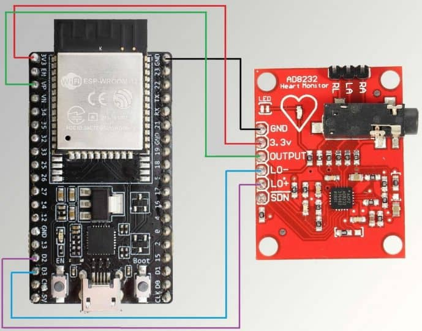
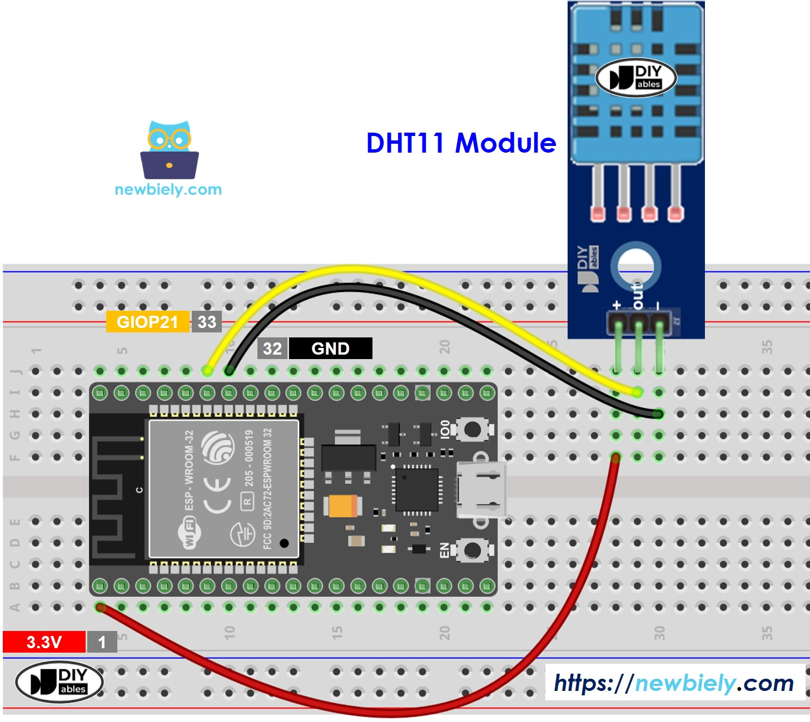
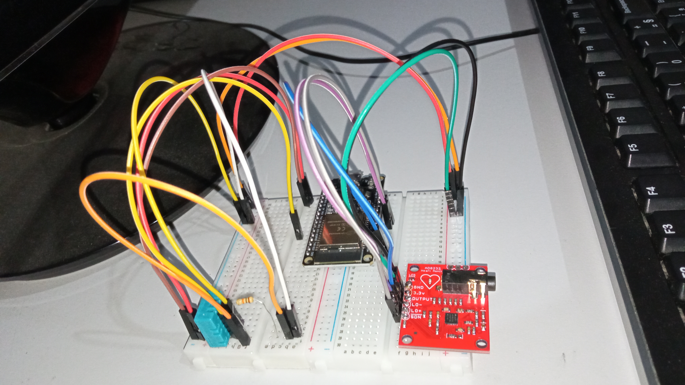
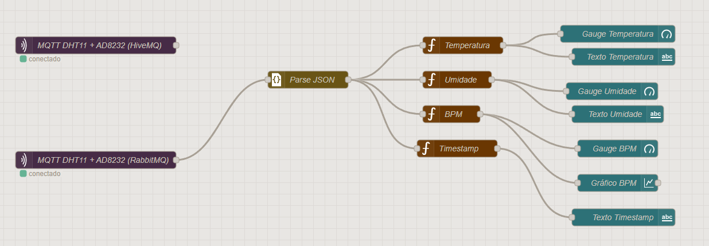

## Armazenamento local e envio de dados via protocolo MQTT

### Disposição dos pinos dos sensores

| Sensor/Dispositivo | Pino Sensor  | Pino ESP32 WROOM | Observação                                     |
| ------------------ | ------------ | ---------------- | ---------------------------------------------- |
| **AD8232**         | 3.3V         | 3V3              | Alimentação                                    |
|                    | GND          | GND              | Terra                                          |
|                    | OUTPUT       | GPIO 34          | Entrada analógica (somente leitura)            |
|                    | LO+          | GPIO 25          | Detecção de eletrodo solto (opcional)          |
|                    | LO–          | GPIO 26          | Detecção de eletrodo solto (opcional)          |
| **DHT11**          | VCC          | 3V3              | Alimentação                                    |
|                    | GND          | GND              | Terra                                          |
|                    | DATA         | GPIO 19          | Comunicação digital com o ESP32                |
|                    | **Resistor** | DATA ↔ 3V3       | Resistor de **10kΩ pull-up** entre DATA e 3.3V |

### Diagramas e foto do projeto com ESP32 físico

**Diagrama AD8232**



**Diagrama DHT11**



**Projeto final**



**Vídeo do funcionamento do projeto**

[Funcionamento ESP32 + AD8232 + RabbitMQ/HiveMQ + Node RED](https://youtu.be/8xiXCnkW8kI)

## 🔧 Como executar o código

Para rodar o projeto, além de ser necessário um ESP32 com as configurações acima é importante que tenha o Docker instalado para rodar o Node-RED e o RabbitMQ localmente para receber os dados exibi-los no dashboard.

Além disso, é necessário configurar as variaveis presentes no arquivo `main/secrets.h` referentes ao IP local da máquina (ou do HiveMQ, juntamente com usuario e senha do cluster), o nome e a senha da rede Wifi.

Para o correto funcionamento com o HiveMQ é necessário adicionar nas configurações de TLS o arquivo `nodered_flow/isrgrootx1.pem` e no arquivo `main/main.ino` substituir a função do Wifi `WiFiSecure` por `WiFiClientSecure` na linha 32 e descomentar a linha 67 com o trecho `espClient.setInsecure()` que desabilita o certificado para o ESP32 enviar os dados ao HiveMQ.

Para importar o dashboard criado no node-RED basta importar o arquivo `nodered_flow/dashboard.json`. Note que haverá dois _MQTT In_, um para a conexão com o RabbitMQ e outro com o HiveMQ. Por padrão está configurado para RabbitMQ como segue a imagem.



Importante salientar que o nome da rede utilizado para acessar o MQTT foi o nome do container (rabbitmq) e não localhost. Isto é necessário pois o node-RED não "enxerga" o RabbitMQ através de _localhost_, porém consegue "enxergar" pelo nome do container pelo fato de estarem compartilhando a mesma rede (cardio-network).

## Relatório Parte 1 – Armazenamento e processamento local (Edge Computing)

### 1. Introdução

Este projeto tem como objetivo a aquisição e o envio de dados fisiológicos e ambientais utilizando o microcontrolador ESP32. Foram utilizados dois sensores:

DHT11 para medir temperatura e umidade do ambiente;

AD8232 para captura do sinal de eletrocardiograma (ECG).

Os dados coletados são enviados para uma plataforma de mensageria (RabbitMQ) de forma contínua. Além disso, foi implementado um sistema de tolerância a falhas utilizando a memória SPIFFS do ESP32, garantindo que nenhuma informação seja perdida caso ocorra queda de conexão com a internet ou indisponibilidade do RabbitMQ.

### 2. Objetivos

Capturar dados de temperatura e umidade (sensor DHT11);

Capturar sinais do coração (sensor AD8232);

Enviar essas informações em tempo real para o RabbitMQ;

Criar um mecanismo de armazenamento local (SPIFFS) para situações de falha na comunicação;

Reenviar automaticamente os dados armazenados localmente assim que a conexão for restabelecida.

### 3. Funcionamento do Sistema

#### 3.1 Aquisição e Envio de Dados

O ESP32 realiza a leitura periódica dos sensores (DHT11 e AD8232). Enquanto a conexão com a internet e o RabbitMQ estiver ativa, os dados são enviados diretamente para o broker.

#### 3.2 Tratamento de Falhas (Sem Internet ou RabbitMQ)

Quando ocorre falha na rede ou no serviço RabbitMQ:

Os dados lidos dos sensores são armazenados em arquivos no SPIFFS no formato JSON;

Cada arquivo recebe um nome no padrão data\_<millis>, em que <millis> representa o tempo de execução do sistema (função millis());

Após armazenar, o sistema verifica novamente a conexão com a internet e com o RabbitMQ;

Caso a conexão continue indisponível, o ESP32 continua armazenando novos dados no SPIFFS até atingir um limite máximo de ~2KB livres.

#### 3.3 Recuperação e Envio de Dados Salvos

Quando a conexão é restabelecida:

O ESP32 lê todos os arquivos JSON salvos no SPIFFS;

Envia os dados armazenados ao RabbitMQ em intervalos de 100 ms;

Após o envio de cada arquivo, ele é excluído do sistema de armazenamento local;

Quando não houver mais arquivos, o sistema retorna ao fluxo normal de envio em tempo real.

### 4. Desafios Enfrentados

Integração entre os sensores (DHT11 e AD8232) e o ESP32;

Comunicação estável com o RabbitMQ via MQTT;

Implementação do sistema de armazenamento SPIFFS para tolerância a falhas;

Garantir que os dados não fossem duplicados ou perdidos durante a reconexão;

Gerenciamento de múltiplos arquivos JSON e controle de tempo no envio (100 ms).

### 5. Conclusão

O projeto conseguiu cumprir os objetivos propostos. Foi possível adquirir dados ambientais e fisiológicos, enviá-los para o RabbitMQ em tempo real e garantir a integridade dos dados mesmo em situações de falha de conexão, utilizando o SPIFFS como armazenamento temporário. A solução mostrou-se eficiente, robusta e aplicável a sistemas IoT que exigem confiabilidade no envio de informações.

## Relatório Parte 2 – Transmissão para nuvem e visualização (Fog/Cloud Computing)

### 1. Introdução

Nesta segunda etapa do projeto, foi desenvolvida a comunicação dos dados coletados pelo ESP32 com a nuvem via MQTT, garantindo que os valores de temperatura, umidade e batimentos cardíacos fossem transmitidos para um broker MQTT. Além do RabbitMQ utilizado localmente, foi implementado suporte ao serviço em nuvem HiveMQ, permitindo portabilidade do sistema.

Além disso, os dados foram consumidos e visualizados em tempo real através de um dashboard construído no Node-RED, contendo indicadores gráficos (gauges), gráficos históricos e informações temporais do último envio.

### 2. Fluxo de Comunicação MQTT

#### 2.1 Publicação no Broker MQTT

O ESP32 publica os dados no formato JSON, contendo as seguintes informações:

```json
{
  "temperature": 25.4,
  "humidity": 61.2,
  "bpm": 72,
  "timestamp": "2025-10-20 14:33:12"
}
```

Esses dados podem ser enviados para:

| Ambiente | Broker MQTT | Protocolo | Status         |
| -------- | ----------- | --------- | -------------- |
| Local    | RabbitMQ    | MQTT      | ✅ Funcionando |
| Nuvem    | HiveMQ      | MQTT      | ✅ Funcionando |

### 3. Fluxo no Node-RED

O Node-RED foi utilizado para captar os dados MQTT e exibir em um dashboard. O fluxo implementado seguiu os seguintes passos:

- MQTT In → Assina o tópico publicado pelo ESP32 (via RabbitMQ ou HiveMQ);
- JSON Parse → Converte a string JSON em objeto;
- Separação dos Dados → Divide temperatura, umidade, bpm e timestamp;
- Dashboard (node-red-dashboard):
- Gauge para temperatura;
- Gauge para umidade;
- Gauge e texto para BPM (batimentos por minuto);
- Texto com data e hora do último envio;
- Gráfico (chart) com histórico dos valores de BPM.

### 4. Interface do Dashboard

A interface exibe:

| Elemento         | Tipo                    | Descrição                                         |
| ---------------- | ----------------------- | ------------------------------------------------- |
| Temperatura      | Gauge                   | Exibe a temperatura em tempo real                 |
| Umidade          | Gauge                   | Exibe a umidade do ambiente                       |
| Batimentos (BPM) | Gauge ou Valor numérico | Valor estimado de batimentos por minuto           |
| Histórico BPM    | Gráfico (chart)         | Histórico das variações dos batimentos            |
| Último envio     | Texto                   | Mostra data/hora da última mensagem MQTT recebida |

### 5. Demonstração Física do Projeto

Foi gravado um vídeo demonstrando o funcionamento do sistema com os componentes reais:

ESP32 + Sensor DHT11 + Sensor AD8232 conectados ao corpo para captura de ECG;

Envio de dados para RabbitMQ ou HiveMQ;

Leitura dos valores no Node-RED em tempo real.

#### ⚠️ Observações sobre o ECG

O sensor AD8232 apresentou ruídos significativos, dificultando a captura precisa dos batimentos cardíacos;

Houve grande variação no valor de BPM, o que afetou a precisão do gráfico;

Mesmo assim, os dados foram enviados com sucesso, comprovando que o fluxo completo (coleta → MQTT → dashboard) está funcional.

### 6. Conclusão

A segunda parte do projeto demonstrou:

- Integração entre ESP32 e brokers MQTT (RabbitMQ local e HiveMQ na nuvem);
- Consumo e exibição dos dados em tempo real via Node-RED Dashboard;
- Implementação de gauges, gráfico histórico e timestamp de transmissão;
- Teste prático com sensores reais.

Mesmo com ruídos no sensor de ECG, o sistema comprovou a viabilidade da solução e a eficácia da comunicação IoT utilizando MQTT.
